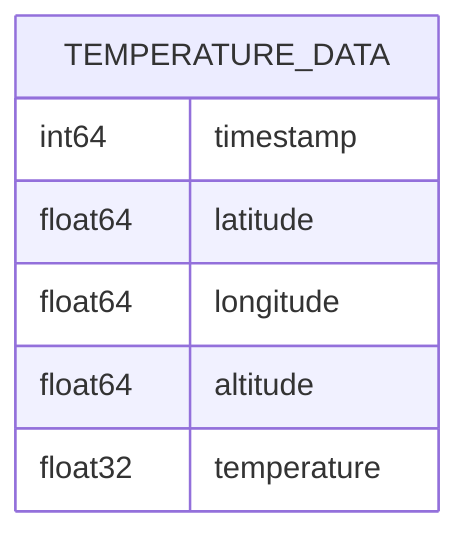
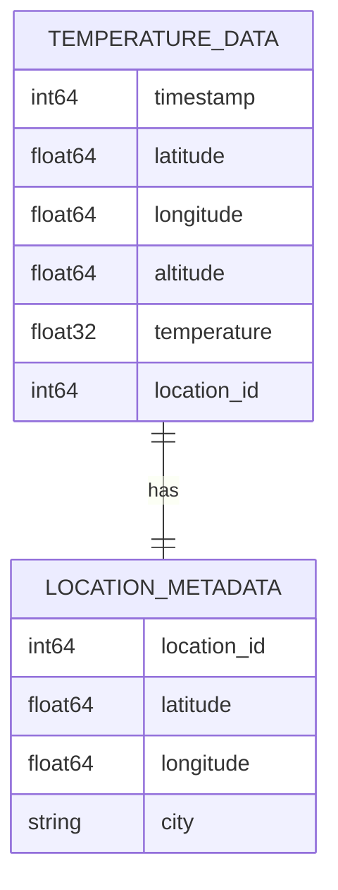

# 🦆 DuckTiles 🀙

## Installation

0. [Install Poetry](https://python-poetry.org/docs/#installation)
1. Clone this repo `git clone https://github/octaflop/ducktiles.git`
2. `poetry install`
3. `poetry run jupyter notebook introduction.ipynb`

## Slides and References

* [SLCPython June 2024 Talk Slides](https://docs.google.com/presentation/d/1qnd0CGMzitNVrYsqYVVvXuyx4C-DqjQuH3G07QQqmzA/edit?usp=sharing)

### Figures

#### TileDB example schema

#### DuckDB example schema

### Links

* [🤓 This Repo](https://github/octaflop/ducktiles.git) : Clone this and follow along
* [🐼 Pandas](https://pandas.pydata.org/) : Consider throwing at your next spreadsheet
    * [🕴️NiceGUI](https://nicegui.io/) : For easy user interfaces / webdev with Pandas
* [🦆 DuckDB](https://duckdb.org/) : A local analytics database
    * [“DuckDB Doesn’t Need Data” Nikolas Göbel](https://www.nikolasgoebel.com/2024/05/28/duckdb-doesnt-need-data.html) :
      In-Depth Article exploring modern database paradigms in 2024
* [🀙 TileDB](https://github.com/TileDB-Inc/TileDB-Py) : Array-Oriented database
